<div align="center">

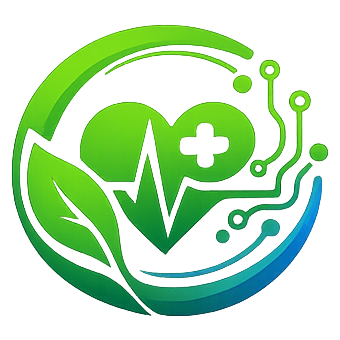

# NutriZen AI

### AI-Powered Nutrition & Meditation Assistant

A full-stack wellness platform that unifies nutrition tracking, hydration and
weight monitoring, meal planning, goal management, mindfulness practices, and
a rule-based recommendation engine into one cohesive application.

[](https://react.dev)
[](https://nodejs.org)
[](https://www.mongodb.com/atlas)
[](./LICENSE)

</div>

---

# 🚀 Live Demo

👉 **Click here to use NutriZen AI:**  
https://nutrizen-ai-hazel.vercel.app

---

## About

NutriZen AI is a full-stack MERN-style application designed to make healthy
living simple and engaging. It combines nutrition tracking, hydration
reminders, weight/BMI monitoring, meal planning, goal management, and guided
mindfulness tools into a single dashboard — backed by a real Node.js/Express
API and a MongoDB Atlas database, with secure JWT authentication.

At its core is a **rule-based recommendation engine** that analyzes each
user's own logged activity (calories, water, goals, BMI) to generate
personalized, scored suggestions — no external AI API, no cost, fully
explainable.

## Features

| Feature | Description |
|---|---|
| Authentication | Secure register/login with JWT tokens and bcrypt password hashing |
| Dashboard | Animated stat cards, trend badges, activity streak, daily insights, and six progress charts |
| Food Scanner | Upload a food photo for an estimated nutrition breakdown and improvement suggestions |
| Food Diary | Chronological log of meals recorded via the Food Scanner |
| Calorie Tracker | Manual & quick-add calorie logging with a 7-day trend chart |
| Water Tracker | One-tap hydration logging, hydration tips, and a 7-day trend chart |
| Weight Tracker | Daily weight logging with an automatic trend chart |
| BMI Calculator | BMI computation with health category and a personalized tip |
| Meal Planner | Weekly meal-planning grid with one-click suggestion chips |
| Goals & Achievements | Create/track goals; unlockable badges reward consistency |
| Meditation & Breathing | Guided timed sessions and a box-breathing exercise |
| Recommendations Engine | Rule-based, scored suggestions across Nutrition, Hydration, Goals, Mindfulness, and Fitness |
| AI Chatbot Assistant | Floating widget answering meal, calorie, sleep, and hydration questions |
| Dark Mode | Full theme toggle, persisted across sessions |
| Notifications | Browser push reminders for hydration & goal milestones |

## 🖼️ Application Preview

<table>
<tr>
<td width="50%">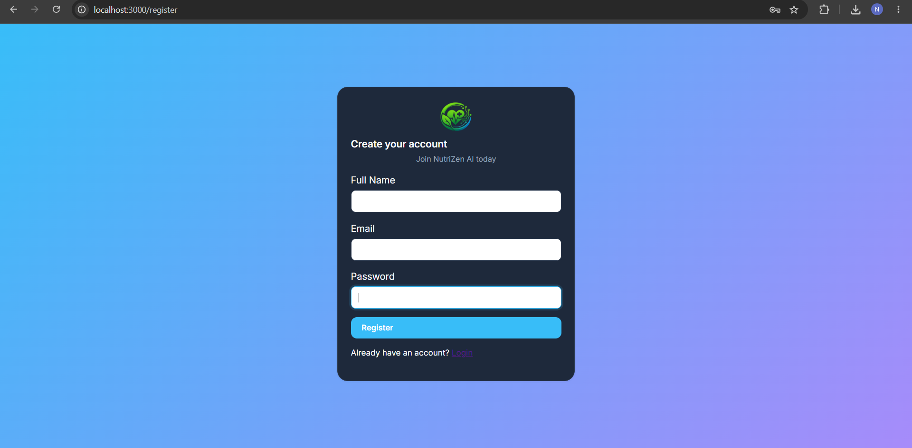<p align="center"><em>Register Page</em></p></td>
<td width="50%">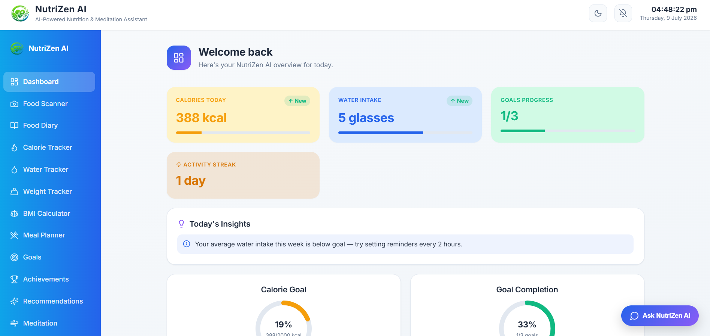<p align="center"><em>Dashboard</em></p></td>
</tr>
<tr>
<td width="50%">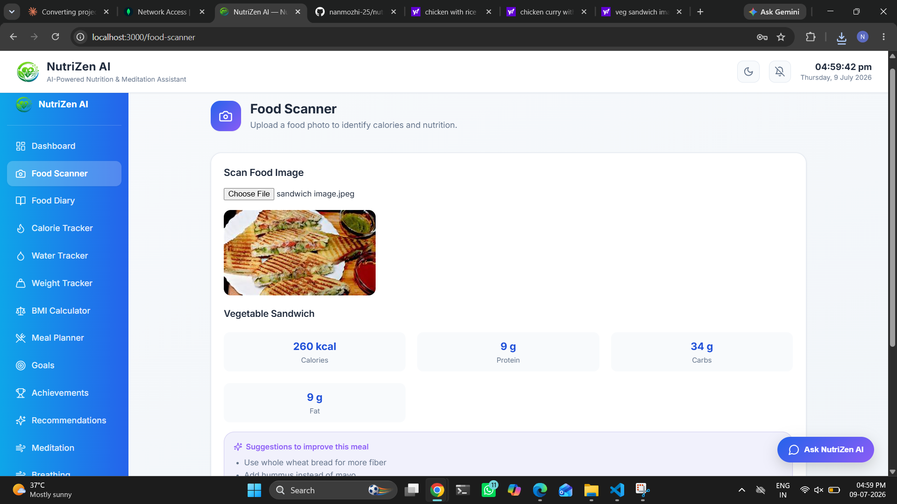<p align="center"><em>Food Scanner</em></p></td>
<td width="50%">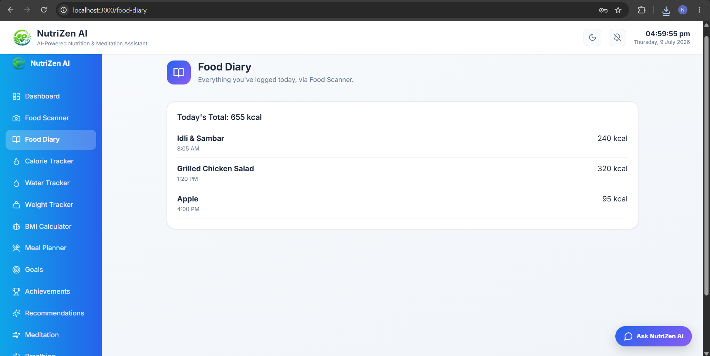<p align="center"><em>Food Diary</em></p></td>
</tr>
<tr>
<td width="50%">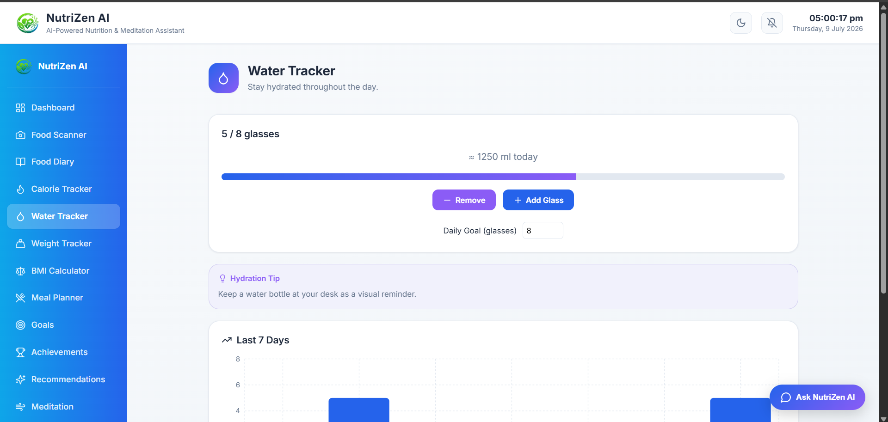<p align="center"><em>Water Tracker</em></p></td>
<td width="50%">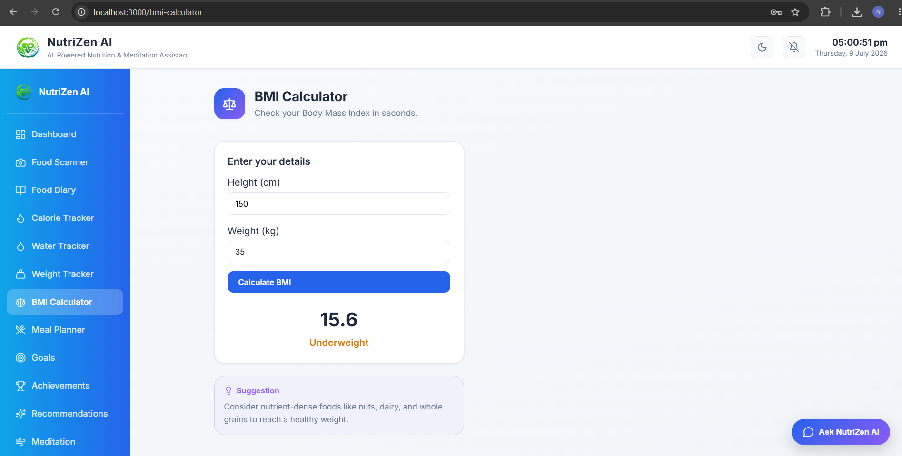<p align="center"><em>BMI Calculator</em></p></td>
</tr>
<tr>
<td width="50%">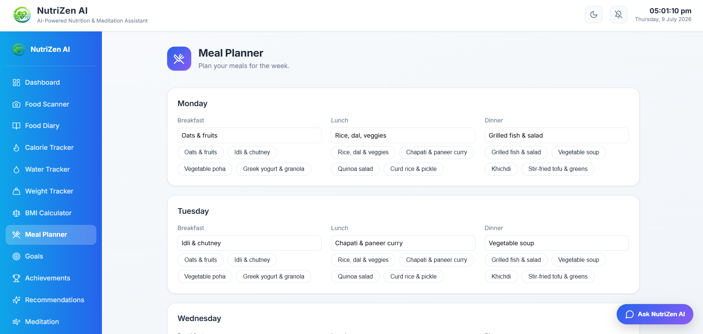<p align="center"><em>Meal Planner</em></p></td>
<td width="50%">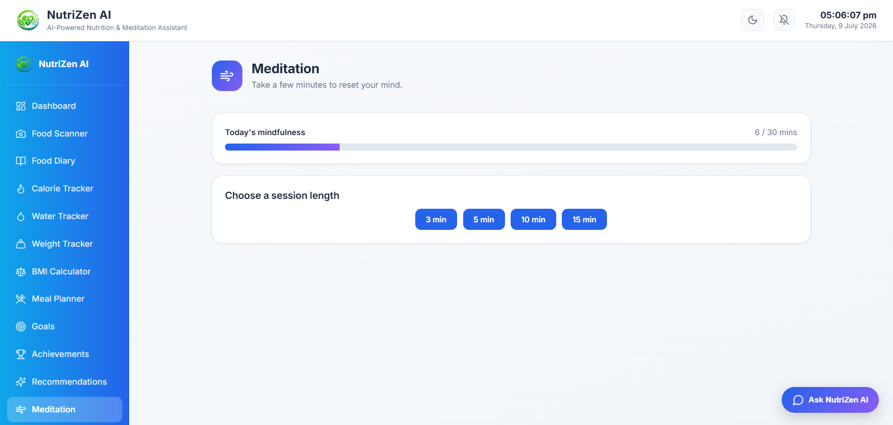<p align="center"><em>Meditation</em></p></td>
</tr>
<tr>
<td width="50%">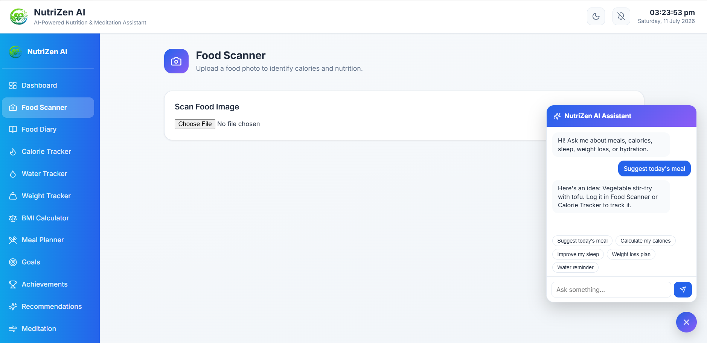<p align="center"><em>AI Chatbot Assistant</em></p></td>
<td width="50%"></td>
</tr>
</table>

## 🏗️ System Architecture

Three-tier architecture: a React SPA (Presentation Layer) talks to an
Express REST API (Application Layer) secured with JWT, which persists data
in MongoDB Atlas (Data Layer). Client-side rule-based engines (recommendations,
insights, chatbot) run entirely in the browser for instant, cost-free
personalization.

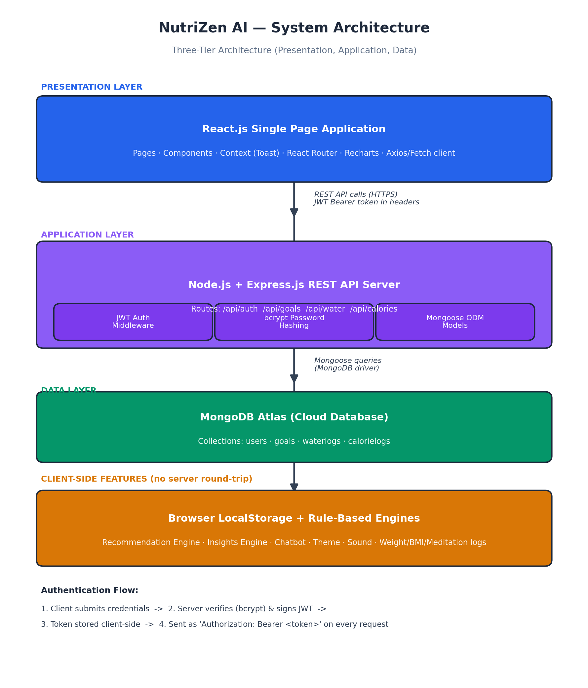

## Tech Stack

**Frontend:** React 18, React Router 6, Recharts, Lucide React, custom CSS design tokens
**Backend:** Node.js, Express.js, Mongoose
**Database:** MongoDB Atlas
**Auth:** JWT + bcrypt.js

> **Note:** The Food Scanner currently uses a mock nutrition-analysis
> function (`src/pages/FoodScanner.jsx`) to simulate image recognition. It's
> structured to be swapped for a real API (e.g. LogMeal, Google Cloud
> Vision) without changing the rest of the flow. This is a documented,
> intentional trade-off — see the project report for details.

## 🤖 AI Features

- **AI Chatbot Assistant** — floating widget answering meal, calorie, sleep, and hydration questions in natural language
- **Rule-Based Recommendation Engine** — categorized, scored, and prioritized suggestions across five wellness dimensions
- **Personalized Nutrition Suggestions** — Food Scanner results include meal-specific improvement tips
- **Daily Health Insights** — dashboard panel generating time-of-day and streak-aware tips from the user's own data
- **Context-Aware Responses** — the chatbot uses the user's live remaining-calorie and hydration status to personalize answers

## 🔒 Security Features

- **JWT Authentication** — stateless, signed session tokens for every logged-in user
- **bcrypt Password Hashing** — passwords are never stored in plain text
- **Protected REST APIs** — every data route is guarded by an authentication middleware
- **User-Based Authorization** — each user can only read or modify their own goals, water logs, and calorie logs
- **Environment Variables** — database credentials and JWT secrets are kept out of source control via `.env`

## Project Structure

```
nutrizen-ai/
├── backend/
│   ├── config/db.js          # MongoDB connection
│   ├── models/                 # User, Goal, WaterLog, CalorieLog
│   ├── routes/                 # auth, goals, water, calories
│   ├── middleware/auth.js  # JWT verification
│   ├── server.js               # Express app entry point
│   └── .env.example
├── public/                       # index.html, logo
├── screenshots/                # README preview images
├── src/
│   ├── components/           # Navbar, Sidebar, charts, chatbot, toast
│   ├── pages/                    # Dashboard, trackers, goals, etc.
│   └── utils/                     # api.js, recommendation engine, chatbot logic
├── .env.example
└── package.json
```

## Getting Started

### Prerequisites
- [Node.js](https://nodejs.org) v16+ and npm
- A free [MongoDB Atlas](https://www.mongodb.com/cloud/atlas/register) cluster

### 1. Clone the repository
```bash
git clone https://github.com/nanmozhi-25/nutrizen-ai.git
cd nutrizen-ai
```

### 2. Set up the backend
```bash
cd backend
npm install
cp .env.example .env
```
Fill in `.env` with your MongoDB connection string and a JWT secret (see
`backend/README.md` for a full MongoDB Atlas setup guide), then start it:
```bash
npm run dev
```

### 3. Set up the frontend
In a new terminal, from the project root:
```bash
npm install
cp .env.example .env
npm start
```
The app opens automatically at `http://localhost:3000`.

## 🚀 Usage

1. Register an account
2. Login securely
3. Track daily calories
4. Monitor hydration
5. Calculate BMI
6. Plan meals
7. Chat with the AI Assistant
8. View personalized recommendations
9. Practice guided meditation

## API Reference

All routes except register/login require `Authorization: Bearer <token>`.

| Method | Route | Description |
|---|---|---|
| POST | `/api/auth/register` | Create a new account |
| POST | `/api/auth/login` | Log in and receive a JWT |
| GET | `/api/auth/me` | Get the current logged-in user |
| GET/POST | `/api/goals` | List / create goals |
| PATCH/DELETE | `/api/goals/:id` | Toggle / delete a goal |
| GET/PUT | `/api/water/:date` | Get / update a day's water log |
| GET | `/api/water?days=7` | Weekly water history |
| GET/POST | `/api/calories/:date` | Get / add a day's calorie entries |
| GET | `/api/calories?days=7` | Weekly calorie history |

Full details in [`backend/README.md`](./backend/README.md).

## Roadmap

- [ ] Connect Food Scanner to a real image-recognition API (LogMeal / Google Vision)
- [ ] Deploy backend (Render) and frontend (Vercel) for a live demo
- [ ] Add automated tests (Jest + React Testing Library)
- [ ] Email-based reminders alongside browser push notifications

## License

Distributed under the MIT License. See [`LICENSE`](./LICENSE) for details.

## Author

**Nanmozhi T**

B.Tech — Artificial Intelligence and Data Science

---

<div align="center">If you found this project useful, consider giving it a star.</div>
