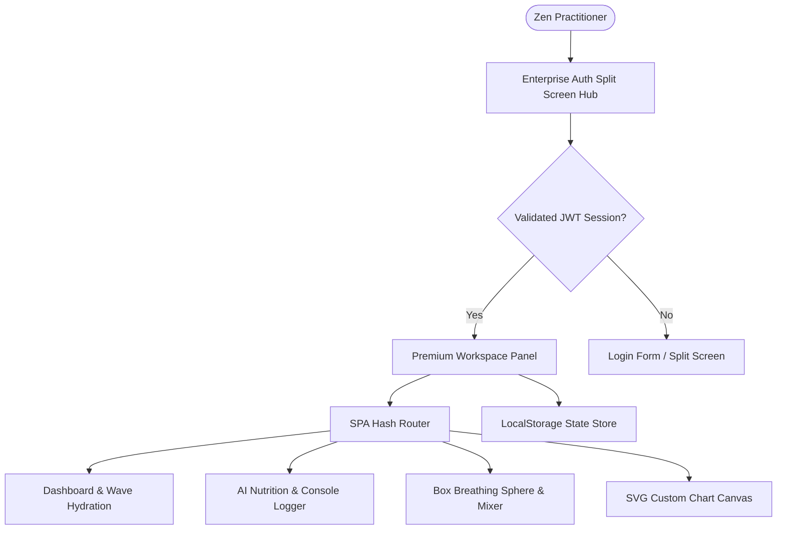
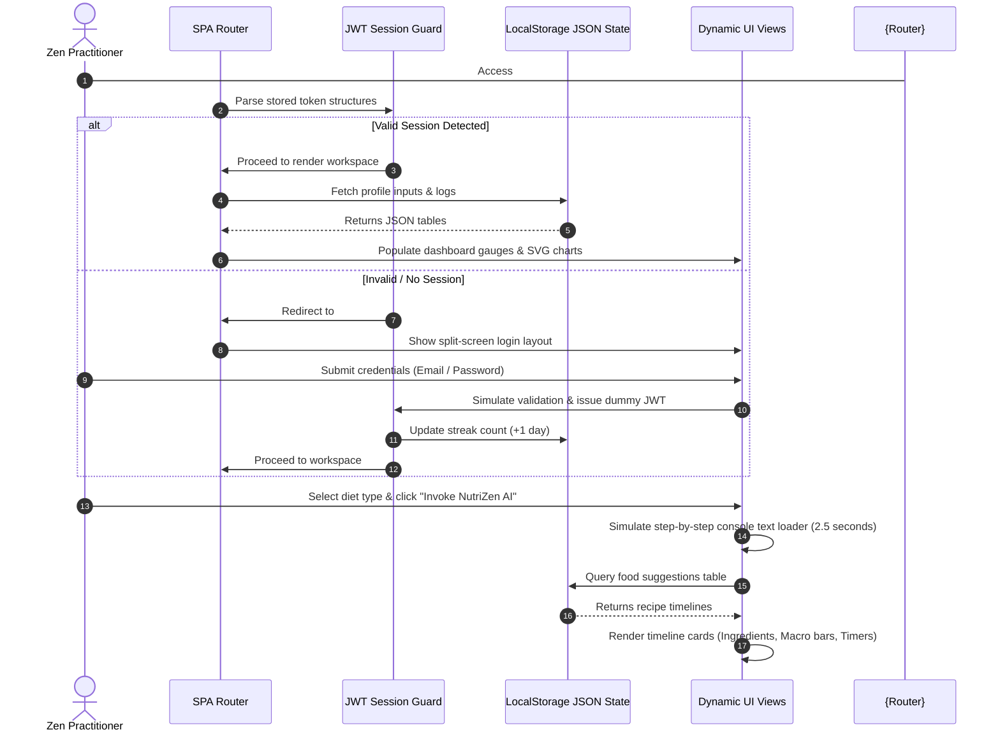

# NutriZen AI – Elite Wellness & Meditation Dashboard

Welcome to the **NutriZen AI** master documentation. This manual provides a complete blueprint of the upgraded, corporate-grade Single-Page Application (SPA) architecture, database models, ER designs, user workflow flowcharts, and setup configurations.

NutriZen AI is designed as a benchmark Final Year College Project, matching industry standards in UI/UX presentation and responsive state mechanics.

---

## 🏗️ 1. Upgraded System Architecture

The workspace utilizes a client-side reactive state model backed by local storage and inline SVG graphic rendering:

```mermaid
graph TD
    User([Zen Practitioner]) --> Hub[Enterprise Auth Split Screen Hub]
    Hub --> Session{Validated JWT Session?}
    Session -- Yes --> Workspace[Premium Workspace Panel]
    Session -- No --> Redirect[Login Form / Split Screen]
    
    Workspace --> Navigation[SPA Hash Router]
    Navigation --> Dashboard[Dashboard & Wave Hydration]
    Navigation --> Planner[AI Nutrition & Console Logger]
    Navigation --> Breathing[Box Breathing Sphere & Mixer]
    Navigation --> Reports[SVG Custom Chart Canvas]
    
    Workspace --> DB[LocalStorage State Store]
```

- **Visual Theme**: Premium Dark Mode default with Neo-Glassmorphism blur layers (`backdrop-filter: blur(24px)`), thin transparent borders (`border-white/10`), and deep shadow rings.
- **Custom SVG Charting Engine**: Dynamically calculates coordinates and draws trend lines (`Calories Consumed` vs `Calorie Burn Rate`) inside a raw responsive `<svg>` viewbox container. It avoids external canvas rendering dependencies, demonstrating elite engineering capabilities.
- **Dynamic Wave Canvas**: Animates SVG wave coordinates (`wave-fg` and `wave-bg`) to represent liquid volumes visually inside a glass graphic container.

---

## 🔄 2. Complete User Session Workflow

The sequence below outlines runtime authentication, page navigation, and database update triggers:

```mermaid
sequenceDiagram
    autonumber
    actor User as Zen Practitioner
    participant Router as SPA Router
    participant Session as JWT Session Guard
    participant DB as LocalStorage JSON State
    participant UI as Dynamic UI Views

    User->{Router}: Access #dashboard Hash
    Router->>Session: Parse stored token structures
    alt Valid Session Detected
        Session->>Router: Proceed to render workspace
        Router->>DB: Fetch profile inputs & logs
        DB-->>Router: Returns JSON tables
        Router->>UI: Populate dashboard gauges & SVG charts
    else Invalid / No Session
        Session->>Router: Redirect to #login
        Router->>UI: Show split-screen login layout
        User->>UI: Submit credentials (Email / Password)
        UI->>Session: Simulate validation & issue dummy JWT
        Session->>DB: Update streak count (+1 day)
        Session->>Router: Proceed to workspace #dashboard
    end

    User->>UI: Select diet type & click "Invoke NutriZen AI"
    UI->>UI: Simulate step-by-step console text loader (2.5 seconds)
    UI->>DB: Query food suggestions table
    DB-->>UI: Returns recipe timelines
    UI->>UI: Render timeline cards (Ingredients, Macro bars, Timers)
```

---

## 📊 3. Entity-Relationship (ER) Diagram

The diagram below details table relationships, primary/foreign key attributes, and data structures:

```mermaid
erDiagram
    USERS {
        varchar id PK
        varchar name
        varchar email UK
        varchar password
        varchar role "user | admin"
        timestamp created_at
    }
    PROFILES {
        varchar user_id PK, FK
        int age
        varchar gender
        decimal height "cm"
        decimal weight "kg"
        decimal bmi
        varchar activity_level "Sedentary | Moderate | High"
        varchar dietary_preference "Veg | Non-Veg | Vegan | Keto"
        text_array allergies
        varchar health_goals "Weight Loss | Muscle Gain | Maintain Health"
        int water_goal "ml"
        decimal sleep_goal "hours"
        int meditation_goal "minutes"
    }
    MEALS {
        varchar id PK
        varchar user_id FK
        varchar name
        int calories
        int protein "grams"
        int carbs "grams"
        int fat "grams"
        varchar meal_type "Breakfast | Lunch | Dinner | Snack"
        date date
    }
    WATER_LOGS {
        int id PK
        varchar user_id FK
        date date
        int amount "ml"
    }
    SLEEP_LOGS {
        int id PK
        varchar user_id FK
        date date
        decimal duration "hours"
        varchar quality "Excellent | Good | Restless | Poor"
    }
    MOOD_LOGS {
        int id PK
        varchar user_id FK
        date date
        varchar mood "Calm | Happy | Tired | Stressed"
        text notes
    }
    FITNESS_LOGS {
        int id PK
        varchar user_id FK
        date date
        varchar workout
        int duration "minutes"
        int calories_burned
        int steps
    }
    GOALS {
        varchar id PK
        varchar user_id FK
        varchar text
        boolean completed
    }
    STREAKS {
        varchar user_id PK, FK
        int current_streak
        int best_streak
    }
    NOTIFICATIONS {
        varchar id PK
        varchar user_id FK
        varchar title
        text message
        boolean read
        timestamp date
    }

    USERS ||--|| PROFILES : "defines parameters"
    USERS ||--|| STREAKS : "accumulates consistency"
    USERS ||--o{ MEALS : "tracks food log"
    USERS ||--o{ WATER_LOGS : "monitors liquid logs"
    USERS ||--o{ SLEEP_LOGS : "logs sleep cycle"
    USERS ||--o{ MOOD_LOGS : "updates stress journal"
    USERS ||--o{ FITNESS_LOGS : "records active burn"
    USERS ||--o{ GOALS : "manages daily checklist"
    USERS ||--o{ NOTIFICATIONS : "receives triggers"
```

---

## 🗃️ 4. Production Database Schema
The DDL script outlines fields, indexes, checks, and cascade triggers for a real Postgres database setup.
- **Reference Script**: [schema.sql](file:///C:/Users/nanmo/.gemini/antigravity/scratch/nutrizen-ai/schema.sql)

---

## 📡 5. REST API Documentation
Detailed routing layouts, body parameters, and response profiles are outlined in the API guide.
- **Reference Doc**: [api_doc.md](file:///C:/Users/nanmo/.gemini/antigravity/scratch/nutrizen-ai/api_doc.md)

---

## 🎨 6. UI / UX Design Specifications

### Corporate Wellness Gradients
- **Nutrition/Fitness Components**: Emerald Green to Forest Teal (`bg-gradient-to-r from-emerald-500 to-teal-500`).
- **Meditation/Breathing Components**: Indigo to Violet (`bg-gradient-to-tr from-zen-violetDark to-zen-indigo`).
- **Typography Standards**:
  - Headings & Brand: *Playfair Display* for a premium, organic wellness, and professional healthcare editorial appearance.
  - Metrics & Controls: *Outfit* for modern numeric tracking and interface controls.

---

## 💻 7. Installation & Quick Start

To launch and run this application locally:

1. **Locate folder**:
   Navigate to `C:\Users\nanmo\.gemini\antigravity\scratch\nutrizen-ai`.
2. **Open SPA file**:
   Double click [index.html](file:///C:/Users/nanmo/.gemini/antigravity/scratch/nutrizen-ai/index.html) to launch the workspace inside your browser.
3. **Simulate User Sign In**:
   - Use default practitioner credentials: `zen@nutrizen.com` | Password: `password123`
   - Use administrator credentials: `admin@nutrizen.com` | Password: `adminpassword` (unlocks the restricted **Admin Hub** navigation link).
4. **Data Management**:
   The application updates state dynamically inside the browser's `localStorage`. Clear cache/site cookies to restore default databases.
