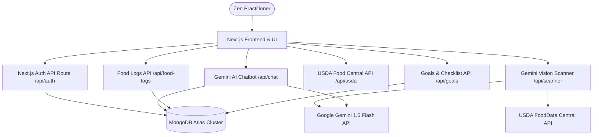

# NutriZen AI – Elite Wellness & AI Nutrition Platform

Welcome to **NutriZen AI**. This repository is a production-ready, full-stack Next.js application unifying AI vision food recognition, USDA nutritional analytics, MongoDB Atlas database persistence, guided box breathing, and ambient soundscapes.

---

## 🏗️ 1. Upgraded Full-Stack Architecture

NutriZen AI uses a modern Next.js Full-Stack Architecture deployed seamlessly on Vercel:


```mermaid
graph TD
    User([Zen Practitioner]) --> App[Next.js Frontend & UI]
    App --> Auth[Next.js Auth API Route /api/auth]
    App --> Scanner[Gemini Vision Scanner /api/scanner]
    App --> Chatbot[Gemini AI Chatbot /api/chat]
    App --> USDA[USDA Food Central API /api/usda]
    App --> Logs[Food Logs API /api/food-logs]
    App --> Goals[Goals & Checklist API /api/goals]
    
    Auth --> MongoDB[(MongoDB Atlas Cluster)]
    Scanner --> GeminiAPI[Google Gemini 1.5 Flash API]
    Scanner --> USDAAPI[USDA FoodData Central API]
    Chatbot --> GeminiAPI
    Chatbot --> MongoDB
    Logs --> MongoDB
    Goals --> MongoDB
```

- **Visual Theme**: Premium Dark Mode default with Neo-Glassmorphism blur layers (`backdrop-filter: blur(24px)`), thin transparent borders (`border-white/10`), and deep shadow rings.
- **Custom SVG Charting Engine**: Dynamically calculates coordinates and draws trend lines (`Calories Consumed` vs `Calorie Burn Rate`) inside a raw responsive `<svg>` viewbox container.
- **Dynamic Wave Canvas**: Animates SVG wave coordinates (`wave-fg` and `wave-bg`) to represent liquid volumes visually inside a glass graphic container.

---

## ⚡ 2. Core Real Features

1. **Real Food Scanner (`/api/scanner`)**: Uses Google Gemini Vision (`gemini-1.5-flash`) for food image recognition + USDA FoodData Central API lookup.
2. **Real AI Chatbot (`/api/chat`)**: Google Gemini API clinical nutritionist chatbot with rate-limiting queue & chat history saved in MongoDB.
3. **Real USDA Nutrition Data (`/api/usda`)**: Live USDA FoodData Central search for calories, protein, carbs, fat, fiber, sugar, sodium.
4. **Real MongoDB Data Flow**: MongoDB Atlas M0 cluster integration (`User`, `FoodLog`, `Goal`, `Routine`, `HealthConcern`, `ChatHistory`, `Notification`).
5. **Real Health Concern Alerts (`/api/food-logs`)**: Automated alerts for Diabetes (sugar limits) & Hypertension (sodium limits).
6. **Real Goals Checklist (`/api/goals`)**: Real-time MongoDB goal checkmark updates & live progress tracking.

---

## 🔑 3. Environment Variables Setup

Create a `.env.local` file or configure Vercel Environment Variables:

| Variable | Purpose | Link |
| :--- | :--- | :--- |
| `GEMINI_API_KEY` | Food Image Recognition & AI Chatbot | [Google AI Studio](https://aistudio.google.com/app/apikey) |
| `USDA_API_KEY` | USDA Food Central API | [USDA API Signup](https://fdc.nal.usda.gov/api-key-signup.html) |
| `MONGODB_URI` | MongoDB Atlas Database Connection | [MongoDB Atlas](https://www.mongodb.com/cloud/atlas/register) |
| `JWT_SECRET` | Authentication Session Token Signing | `nutrizen_sec_9f8a3b127c4d5e6f8091a2b3c4d5e6f` |

---

## 🌐 4. Installation & Quick Start

```bash
# 1. Install dependencies
npm install

# 2. Run local development server
npm run dev

# 3. Build production bundle
npm run build
```
